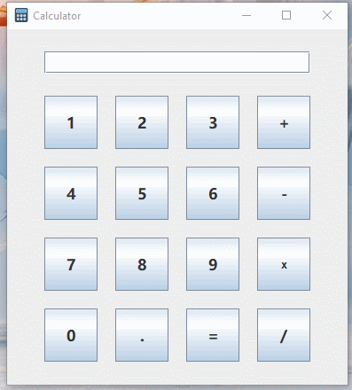
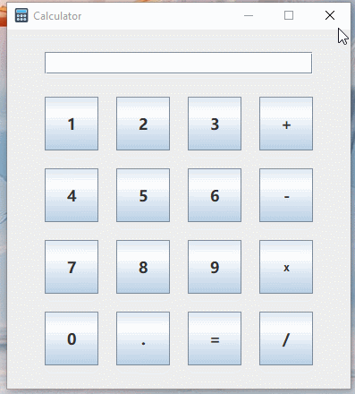

# 1 这是什么？
一个简易的java计算器。

支持鼠标以及键盘输入。





# 2 环境
自带了一个OpenJDK11制成的JRE，无需任何环境。

若是使用自带的JDK编译运行，请确保JDK8+。

自带JRE生成命令如下：
```bash
cd JDK_PATH            # JDK所在路径

jlink 
--module-paths jmods   # OpenJDK11的模块默认放在jmods下

--add-modules 
java.base,             # Java SE平台基础API 
java.desktop,          # AWT+Swing包
jdk.compiler           # 定义编译器以及javac的实现，可选，若无需编译可以去掉

--output jre           # 输出文件夹
```

# 3 运行
## 3.1 Win

### 3.1.1 通过`release`下的EXE运行（建议）
### 3.1.2 通过IDE运行
由于只有一个源代码文件，直接在Eclipse或者IDEA中新建一个Java项目，直接把源码`Calculator.java`复制即可编译运行。
### 3.1.3 通过JAR运行

`Win+R`，输入`cmd`，打开控制台，并输入：
```bash
# 使用非自带JRE
java -jar release\Calculator.jar

# 使用自带JRE
cd SimpleCalculator-java\jre\bin
java -jar ..\..\release\Calculator.jar
```
### 3.1.4 编译运行

`cmd`输入：
```bash
# 使用非自带JRE
javac -encoding utf8 Calculator.java
java -Dfile.encoding=utf-8 Calculator

# JDK11以上可以直接
# java -Dfile.encoding=utf-8 Calculator.java
# 
# 使用powershell的话需要加单引号
# javac -encoding utf8 Calculator.java
# java '-Dfile.encoding=utf-8' Calculator
# 
# java '-Dfile.encoding=utf-8' Calculator.java

# 使用自带JRE
cd SimpleCalculator-java\jre\bin
del ..\..\*.class # JDK11需要先删除（原来使用javac编译出来的）.class文件
java -classpath ..\.. -Dfile.encoding=utf-8 ..\..\Calculator.java # 需要指定类搜索路径，不然会抛出图标空指针异常

# 同理使用powershell的话需要加单引号
# java '-Dfile.encoding=utf-8' ..\..\Calculator.java
```

## 3.2 Linux/Mac

### 3.2.1 通过JAR运行（推荐）

```bash
# 使用非自带JRE
java -jar release/Calculator.jar

# 使用自带JRE
cd SimpleCalculator-java/jre/bin
java -jar ../../release/Calculator.jar
```

### 3.2.2 通过IDE运行
同Win。

### 3.2.3 编译运行

```bash
# 使用非自带JRE
javac -encoding utf8 Calculator.java
java -Dfile.encoding=utf-8 Calculator
# JDK11以上可以直接
# java -Dfile.encoding=utf-8 Calculator.java

# 使用自带JRE
cd SimpleCalculator-java/jre/bin
rm -rf ../../*.class # JDK11需要先删除（原来使用javac编译出来的）.class文件
java -classpath ../.. -Dfile.encoding=utf-8 ../../Calculator.java # 需要指定类搜索路径，不然会抛出图标空指针异常
```

# 4 其他
觉得有用的可以给个Star。

有问题可以在issue反映。

非常感谢您的反馈。

# 更新日志
# 2020.07.03 更新
- 修复键盘回车键重复提示
- 兼容JDK8，去掉`String`的`isBlank()`方法
- 优化输出格式
- 反射优化代码
- 优化UI
- 其他若干
- 更新文档

# 2020.06.17 更新
- 修复空字符串问题
- 更新文档

# 2020.06.16 更新
- 打包JAR与EXE

# 2020.06.15 更新
- 合并为单文件
- 更新文档
